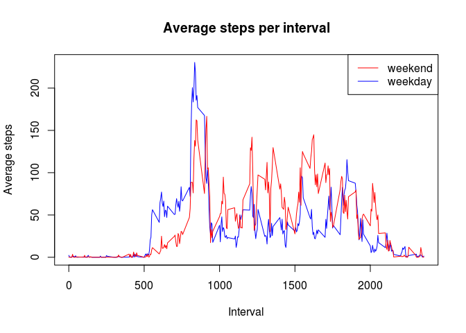

# Reproducible Research: Peer Assessment 1


## Loading and preprocessing the data
Set the working direcorty

```r
setwd('/home/kvar/Documents/Coursara/Reproducible Research/Week 2/RepData_PeerAssessment1')
```

Read in the data

```r
activity = read.csv('activity.csv')
```

Convert the "date" field to a date data type

```r
activity$date = as.Date(activity$date)
```

## What is mean total number of steps taken per day?
Calculate the total number of steps taken per day

```r
steps_per_day = tapply(X = activity$steps, 
                       INDEX = activity$date, 
                       FUN = sum, 
                       na.rm = TRUE)
steps_per_day
```

```
## 2012-10-01 2012-10-02 2012-10-03 2012-10-04 2012-10-05 2012-10-06 
##          0        126      11352      12116      13294      15420 
## 2012-10-07 2012-10-08 2012-10-09 2012-10-10 2012-10-11 2012-10-12 
##      11015          0      12811       9900      10304      17382 
## 2012-10-13 2012-10-14 2012-10-15 2012-10-16 2012-10-17 2012-10-18 
##      12426      15098      10139      15084      13452      10056 
## 2012-10-19 2012-10-20 2012-10-21 2012-10-22 2012-10-23 2012-10-24 
##      11829      10395       8821      13460       8918       8355 
## 2012-10-25 2012-10-26 2012-10-27 2012-10-28 2012-10-29 2012-10-30 
##       2492       6778      10119      11458       5018       9819 
## 2012-10-31 2012-11-01 2012-11-02 2012-11-03 2012-11-04 2012-11-05 
##      15414          0      10600      10571          0      10439 
## 2012-11-06 2012-11-07 2012-11-08 2012-11-09 2012-11-10 2012-11-11 
##       8334      12883       3219          0          0      12608 
## 2012-11-12 2012-11-13 2012-11-14 2012-11-15 2012-11-16 2012-11-17 
##      10765       7336          0         41       5441      14339 
## 2012-11-18 2012-11-19 2012-11-20 2012-11-21 2012-11-22 2012-11-23 
##      15110       8841       4472      12787      20427      21194 
## 2012-11-24 2012-11-25 2012-11-26 2012-11-27 2012-11-28 2012-11-29 
##      14478      11834      11162      13646      10183       7047 
## 2012-11-30 
##          0
```

Create a histogram of the total number of steps taken each day

```r
hist(steps_per_day,
     main = 'Histogram of steps per day',
     xlab = 'Steps per day',
     ylab = 'Number of days')
```

<!-- -->

Calculate the **mean** of the total number of steps taken per day

```r
mean(steps_per_day)
```

```
## [1] 9354.23
```

Calculate the **median** of the total number of steps taken per day

```r
median(steps_per_day)
```

```
## [1] 10395
```

## What is the average daily activity pattern?
Create a time series plot of the 5-minute interval (x-axis) and the average number of steps taken, averaged across all days (y-axis)

```r
avg_steps_per_interval = tapply(X = activity$steps, 
                                INDEX = activity$interval, 
                                FUN = mean, 
                                na.rm=TRUE)

plot(x = names(avg_steps_per_interval), 
     y = avg_steps_per_interval,
     type = 'l',
     main = 'Average steps per interval',
     xlab = 'Interval',
     ylab = 'Average steps')
```

<!-- -->

Determine the 5-minute interval, on average across all the days in the dataset, contains the maximum number of steps.

```r
subset(x = avg_steps_per_interval, 
       subset = avg_steps_per_interval == max(avg_steps_per_interval))
```

```
##      835 
## 206.1698
```

## Imputing missing values
Create new coloum for steps called "steps_imputed".
"steps_imputed" will use the same values as "steps" but will fill in NA records with the averge steps of specific 5-minute interval.

```r
# Create new column
activity$steps_imputed = activity$steps

# Loop through each interval
for (interval in names(avg_steps_per_interval)) {
    # Determin current interval and if NA
    is_interval = activity$interval == interval
    is_na = is.na(activity$steps_imputed)
    
    # Overwrite NA for current interval if NA with averge for that interval
    activity[is_interval & is_na, 'steps_imputed'] = avg_steps_per_interval[interval]
}
```

With the new data, create a histogram of the total number of steps

```r
steps_per_day_imputed = tapply(X = activity$steps_imputed, 
                               INDEX = activity$date, 
                               FUN = sum, 
                               na.rm = TRUE)

hist(steps_per_day_imputed,
     main = 'Histogram of steps per day (imputed)',
     xlab = 'Steps per day',
     ylab = 'Number of days')
```

<!-- -->

With the imputed data, report the **mean** total number of steps taken per day. 

```r
mean(steps_per_day_imputed)
```

```
## [1] 10766.19
```

With the imputed data, report the **median** total number of steps taken per day. 

```r
median(steps_per_day_imputed)
```

```
## [1] 10766.19
```

Compair the orginal and to the imputed histogram

```r
par(mfrow=c(1,2))

# orginal
hist(steps_per_day,
     main = 'Steps per day (orginal)',
     xlab = 'Steps per day',
     ylab = 'Number of days')

# imputed
hist(steps_per_day_imputed,
     main = 'Steps per day (imputed)',
     xlab = 'Steps per day',
     ylab = 'Number of days')
```

<!-- -->

Compair the **mean** of the imputed data to the orginal.

```r
paste('orginal mean', mean(steps_per_day))
```

```
## [1] "orginal mean 9354.22950819672"
```

```r
paste('imputed mean', mean(steps_per_day_imputed))
```

```
## [1] "imputed mean 10766.1886792453"
```

With the new data, report the **median** total number of steps taken per day. 

```r
paste('orginal median', median(steps_per_day))
```

```
## [1] "orginal median 10395"
```

```r
paste('imputed median', median(steps_per_day_imputed))
```

```
## [1] "imputed median 10766.1886792453"
```

## Are there differences in activity patterns between weekdays and weekends?

Create a new factor variable to determine “weekday” and “weekend”

```r
# Determine if date is a weekday or weekend
weekday = weekdays(activity$date, abbr = TRUE)
is_weekday = weekday %in% c('Mon', 'Tue', 'Wed', 'Thu', 'Fri')

# Create a factor to determin if date is a weekday or weekend
activity$weekday = as.factor(is_weekday)
levels(activity$weekday) = c('weekend', 'weekday')
```

Create a line plot comparing average steps (imputed) (y-axis) of 5-minute interval (x-axis) on weekdays to weekends.

```r
# Compute the mean of imputed steps by interval and weekday
avg_steps_by_interval_weekday = 
    tapply(X = activity$steps_imputed,
           INDEX = list(activity$interval,
                        activity$weekday),
           FUN = mean)

# Convert results to a dataframe
avg_steps_by_interval_weekday = as.data.frame(avg_steps_by_interval_weekday)

# Plot the average of weekdays and weekends.
plot(x = rownames(avg_steps_by_interval_weekday), 
     y = avg_steps_by_interval_weekday$weekday,
     type = 'l',
     col = 'blue',
     main = 'Average steps per interval',
     xlab = 'Interval',
     ylab = 'Average steps')

lines(x = rownames(avg_steps_by_interval_weekday), 
      y = avg_steps_by_interval_weekday$weekend,
      type = 'l',
      col = 'red')

legend(x = 'topright', 
       y = names(avg_steps_by_interval_weekday), 
       lty=1, 
       col=c('red', 'blue'))
```

<!-- -->


